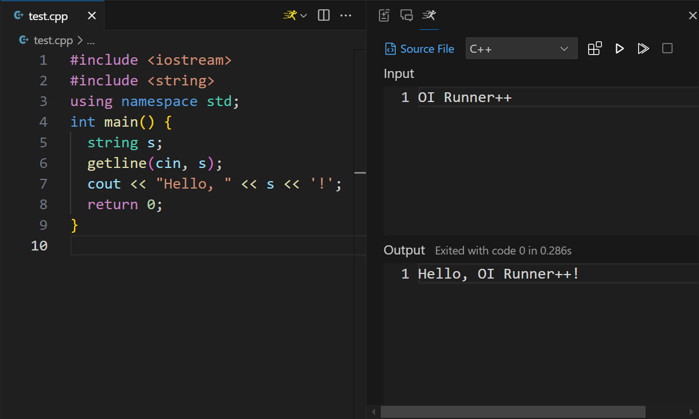

# OI Runner++

> [!TIP]
>
> Read more 👉 [English](https://oi-runner-2.by-ts.top/en/)｜[简体中文](https://oi-runner-2.by-ts.top/zh-cn/)

VS Code extension designed for OIer and ACMer, for running single file program.



## Configuration

<!-- #region config -->

### `oi-runner-2.tasks`

Defines the tasks available in the run panel and their corresponding compilation and execution commands.

Format:

```jsonc
{
  "oi-runner-2.tasks": {
    "C++": { // Task label
      "compile": [ // Compilation command and arguments
        "g++",
        ["${file}", "-o${fileNoExt}", "-std=c++14", "-O2"] // The use of ${} is explained below
      ],
      "execute": [ // Execution command, required
        "${fileNoExt}${execExt}",
        []
      ]
    },
    "Python": {
      // The compilation command can be empty; the compile button will not be displayed when this task is selected
      "execute": [
        "python",
        ["${file}"]
      ]
    }
    // ...
  }
}
```

There are special strings in the commands and arguments that will be replaced with actual information when executed:

| Special String | Replaced With |
| --- | --- |
| `${file}` | The absolute path of the source file |
| `${fileNoExt}` | The absolute path of the source file without the extension |
| `${execExt}` | The extension of the executable file, `.exe` on Windows, an empty string on other systems |

The working directory is the opened folder.

### `oi-runner-2.defaultTask`

Defines the default task selected in the run panel when a file is opened.

Format:

```jsonc
{
  "oi-runner-2.tasks": {
    "C++": { /* ... */ },
    "Python": { /* ... */ }
  },
  "oi-runner-2.defaultTask": {
    ".py": "Python" // Files with the .py extension default to Python
    // Others default to the first task defined in oi-runner-2.tasks, which is C++ in this example
    // You can also set it to `false`, and the run panel won't switch to files with this extension
  }
}
```

### `oi-runner-2.addToRunMenu`

Whether to add OI Runner++ to the editor title menu.

If disabled, you need to press <kbd>Ctrl</kbd> + <kbd>Shift</kbd> + <kbd>P</kbd> and search for `Launch OI Runner++` to open the run panel.

Format: `true` (default) or `false`.

<!-- #endregion config -->

## Credits

This project is deeply inspired by [OI Runner](https://github.com/CmdBlockZQG/oi-runner). Thanks to [@CmdBlockZQG](https://github.com/CmdBlockZQG) and other contributors of OI Runner.
