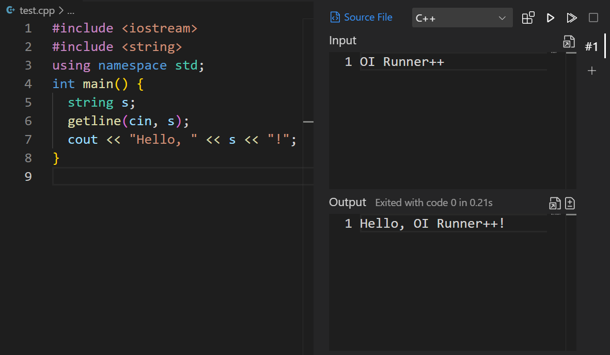

# OI Runner++

> English｜[简体中文](https://gitee.com/typed-sigterm/oi-runner-2/blob/main/README.zh-CN.md)

VS Code extension designed for OIers and ACMers, for running single-file programs.

## Quick Start

The Story Behind OI Runner++

 

Running single C++ files in VS Code isn't straightforward, and I've **suffered** from this. Online tutorials often require configuring **lengthy, complex, and arcane** `.vscode/launch.json` and `.vscode/tasks.json` files, which is pure torture.

Compared to that, the [Code Runner](https://marketplace.visualstudio.com/items?itemName=formulahendry.code-runner) extension offers a better experience, but it's not suitable for the specific scenario of OI (competitive programming):

- It leaves messy history in the Terminal.
- It doesn't show execution time or exit code.
- You have to manually input test cases every time.

Later, I discovered [OI Runner](https://marketplace.visualstudio.com/items?itemName=CmdBlock.oi-runner). It's tailor-made for the OI scenario, and I personally think its experience is nearly perfect. However, after using it for a while, some issues became apparent:

- Execution time and exit code are mixed with the output.
- There's no status indication for compiling/running.
- The stop button doesn't work.
- The working directory for compilation/execution is the source file's directory, not the workspace directory.

I submitted a [PR](https://github.com/CmdBlockZQG/oi-runner/pull/9), but the maintainer seems to have abandoned OI Runner and didn't respond.

On 2024/6/21, I decided to develop OI Runner++, completely rewriting it based on OI Runner and releasing it. Therefore, OI Runner++ retains OI Runner's concise UI design but improves upon many features.

Install the extension from one of:

- [VS Code Marketplace](https://marketplace.visualstudio.com/items?itemName=typed-sigterm.oi-runner-2)
- [Open VSX](https://open-vsx.org/extension/typed-sigterm/oi-runner-2)

For a quick start guide:

1. Open the Command Palette (<kbd>Ctrl</kbd> + <kbd>Shift</kbd> + <kbd>P</kbd>)
2. Enter & select `Welcome: Open Walkthrough...`
3. Enter & select `Get Started with OI Runner++`

## Configuration

All configuration descriptions can be accessed via the VS Code settings UI (<kbd>Ctrl</kbd> + <kbd>,</kbd>) by searching for `@ext:typed-sigterm.oi-runner-2`.

## Credits

This project is deeply inspired by [OI Runner](https://github.com/CmdBlockZQG/oi-runner). Thanks to [@CmdBlockZQG](https://github.com/CmdBlockZQG) and other contributors of OI Runner.
