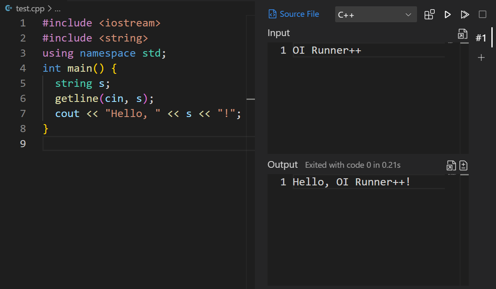
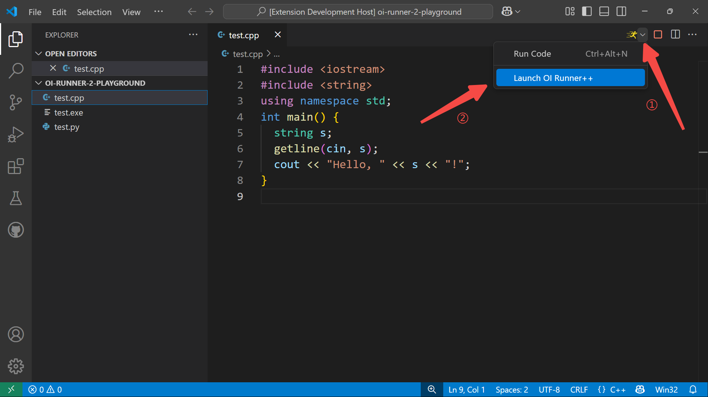
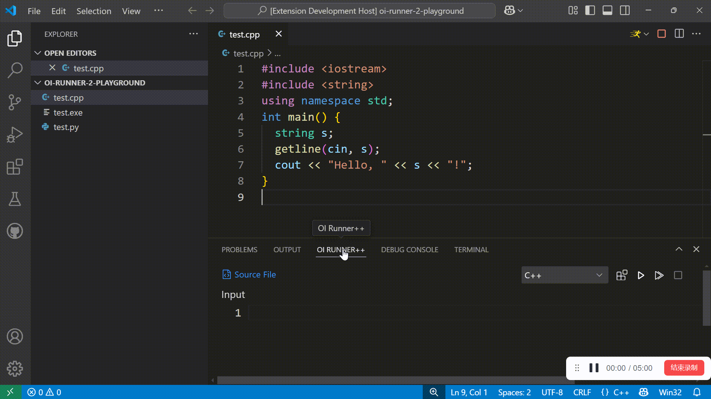
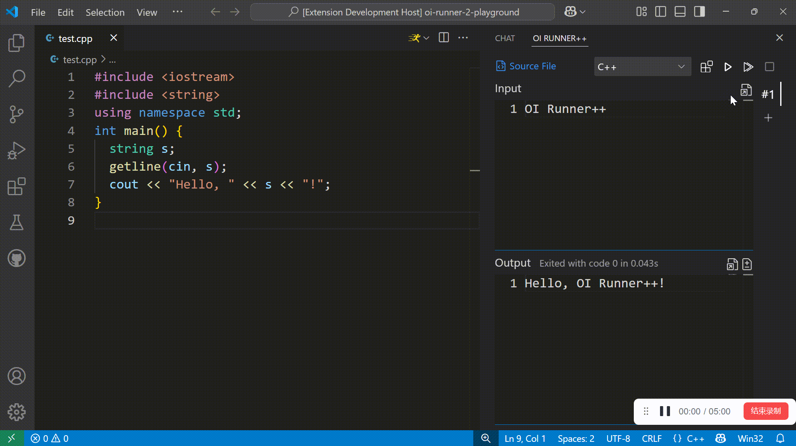
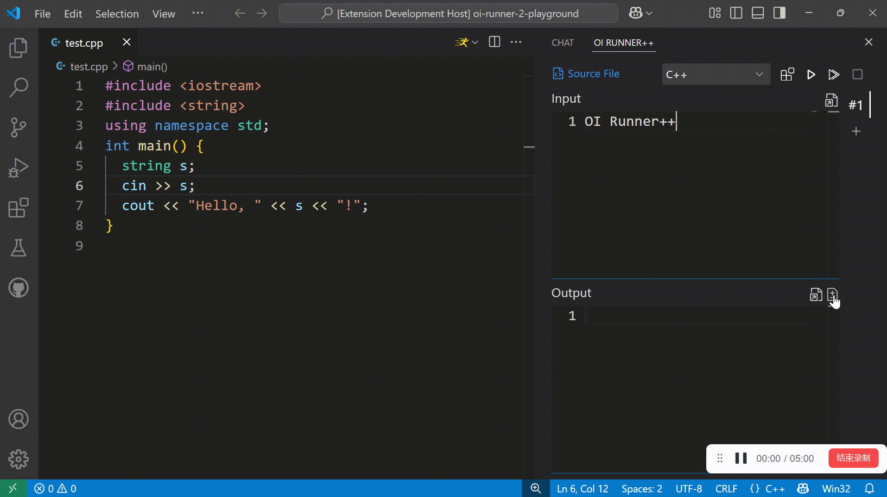
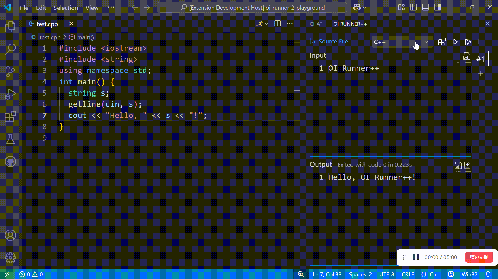

# OI Runner++

> [English](https://github.com/typed-sigterm/oi-runner-2/blob/main/README.md)｜简体中文

专为 OIer 和 ACMer 设计的 VS Code 插件，用于运行单文件程序。



## 快速上手

<details>

<summary>OI Runner++ 的由来</summary>
<br>

在 VS Code 中运行 C++ 单文件程序并非易事，我就**深受其害**。网上的教程大多要求配置**冗长、复杂、玄学**的 `.vscode/launch.json` 和 `.vscode/tasks.json`，这完全是一种折磨。

相比之下，[Code Runner](https://marketplace.visualstudio.com/items?itemName=formulahendry.code-runner) 插件的体验好一些，但并不适合 OI 这一特殊场景：

- 会在 Terminal 中留下难看的历史记录
- 不显示运行耗时、退出代码
- 每次都要手动输入样例

后来，我发现了 [OI Runner](https://marketplace.visualstudio.com/items?itemName=CmdBlock.oi-runner)。它是为 OI 场景量身打造的，个人认为其体验已接近完美。但是经过较长时间的使用后，一些问题逐渐显现：

- 运行耗时、退出代码与输出混在一起
- 没有编译中/运行中的状态提示
- 停止运行按钮无效
- 编译/运行时的工作目录是源代码目录，而非工作区目录

我提了一个 [PR](https://github.com/CmdBlockZQG/oi-runner/pull/9)，然而维护者似乎已经放弃维护 OI Runner，没有回复。

2024/6/21，我决定开发 OI Runner++，以 OI Runner 为蓝本进行完全重写并发布。因此，OI Runner++ 保留了 OI Runner 简洁的 UI 设计，但在不少功能上进行了改进。

</details>

安装此插件（[OI Runner++](https://marketplace.visualstudio.com/items?itemName=typed-sigterm.oi-runner-2)），打开一个文件夹，写一些代码然后按 <kbd>Ctrl</kbd> + <kbd>S</kbd> 保存。



如果运行面板在底部，你可以像这样把它拖到右侧：



这样就好了：


也可以添加多组输入输出样例：



当前编辑的文件切换时，运行面板中的内容也会跟着切换。

你也可以启用 diff 功能，写入期望的输出，运行后会自动与实际输出对比：



如果想运行其他语言的程序，也可以切换任务：



OI Runner++ 默认支持的语言有：

- C++（编译参数：`-std=c++14 -O2`）
- Python

如果你需要其他语言的支持，或者修改编译选项，请阅读下文的[配置](#配置)。

运行代码之前，切记要保存文件，否则运行的程序仍是上次保存的代码。

## 配置

<details>

<summary>如何进入配置界面</summary>
<br>

如果你想修改当前工作区（文件夹）的配置，创建 `.vscode/settings.json` 文件即可。

如果你想把配置应用到所有工作区，按 <kbd>Ctrl</kbd> + <kbd>,</kbd> 打开 VS Code 设置，按右上角“打开设置（JSON）”按钮即可打开全局配置文件：


</details>

### `oi-runner-2.tasks`

定义运行面板中可选的任务和对应的编译、执行命令。

格式：

```jsonc
{
  "oi-runner-2.tasks": {
    "C++": { // 任务名称
      "compile": [ // 编译命令和参数
        "g++",
        ["${file}", "-o${fileNoExt}", "-std=c++14", "-O2"] // ${} 的用法请参考下文
      ],
      "execute": [ // 执行命令，必填
        "${fileNoExt}${execExt}",
        []
      ]
    },
    "Python": {
      // 编译命令可以为空，选择此任务时不会显示编译按钮
      "execute": [
        "python",
        ["${file}"]
      ]
    }
    // ...
  }
}
```

命令和参数中有一些特殊字符串，执行时会被替换为实际信息：

| 特殊字符串 | 替换为 |
| --- | --- |
| `${file}` | 源文件的绝对路径 |
| `${fileNoExt}` | 源文件的绝对路径去掉扩展名的部分 |
| `${execExt}` | 可执行文件的扩展名，Windows 下为 `.exe`，其他系统为空字符串 |

命令的执行目录是当前打开的文件夹。

### `oi-runner-2.defaultTask`

打开文件时，运行面板默认选择的语言。

格式：

```jsonc
{
  "oi-runner-2.tasks": {
    "C++": { /* ... */ },
    "Python": { /* ... */ }
  },
  "oi-runner-2.defaultTask": {
    ".py": "Python" // 拓展名是 .py 的文件默认选择 Python
    // 如果一个文件的拓展名没有在这里指定默认任务，则运行面板不会切换到这个文件
  }
}
```

### `oi-runner-2.addToRunMenu`

是否将 OI Runner++ 添加到编辑器的运行按钮选项中。

如果禁用，则需要通过 <kbd>Ctrl</kbd> + <kbd>Shift</kbd> + <kbd>P</kbd> 打开命令面板，搜索 `Launch OI Runner++` 打开运行面板。

格式：`true`（默认）或 `false`

### `oi-runner-2.textareaMaxSize`

stdout 文本框的最大长度，单位为字节而不是字符，编码方式为 UTF-8。

过长的字符串会导致长时间无响应，若输入或输出过长，请重定向到文件。

格式：数值（默认 `1e4`）。

## 鸣谢

OI Runner++ 深受 [OI Runner](https://github.com/CmdBlockZQG/oi-runner) 启发，感谢 [@CmdBlockZQG](https://github.com/CmdBlockZQG) 及其他贡献者。
